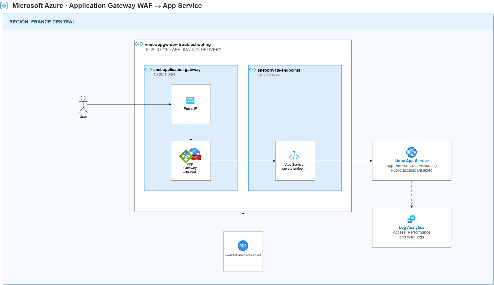

# Private DNS troubleshooting

## Scenario

This lab deploys an Azure Application Gateway with WAF enabled in front of a private Azure App Service.

The objective is to send legitimate and malicious HTTP requests and use Application Gateway and WAF logs to determine whether the requests passed through the WAF, were allowed, or were blocked.



## Troubleshooting scenarios

1. Send a legitimate request through Application Gateway and verify that it reaches the App Service.
2. Send a malicious XSS request and verify that the WAF blocks it with HTTP 403 Forbidden.
3. Review Application Gateway Access Logs to confirm that the requests reached the gateway.
4. Review Application Gateway Firewall Logs to identify the WAF rule that detected and blocked the malicious request.
5. Attempt to access the App Service directly and verify that public access is disabled.

## Troubleshooting notes

### Scenario 1: Legitimate request through Application Gateway

Send a legitimate request to the public IP address of Application Gateway:

```bash
curl -i "http://<APPLICATION_GATEWAY_IP>/?lab=normal-request"
```

The expected result is a successful response from the App Service.


### Scenario 2: Malicious XSS request

Send a test XSS request:

```bash
curl --max-time 30 -i \
  "http://<APPLICATION_GATEWAY_IP>/waf-xss-test?q=%3Cscript%3Ealert%281%29%3C%2Fscript%3E"
```

The expected result is:

```text
HTTP/1.1 403 Forbidden
Server: Microsoft-Azure-Application-Gateway/v2
```

### Scenario 3: Review Application Gateway access logs

Use Log Analytics to verify that requests reached Application Gateway:

```kusto
AzureDiagnostics
| where TimeGenerated > ago(30m)
| where Category == "ApplicationGatewayAccessLog"
| order by TimeGenerated desc
```

These logs contain legitimate and malicious requests received by Application Gateway.


### Scenario 4: Review WAF firewall logs

Use Log Analytics to find requests that triggered WAF rules:

```kusto
AzureDiagnostics
| where TimeGenerated > ago(30m)
| where Category == "ApplicationGatewayFirewallLog"
| order by TimeGenerated desc
```

To find the XSS test specifically:

```kusto
AzureDiagnostics
| where TimeGenerated > ago(30m)
| where Category == "ApplicationGatewayFirewallLog"
| where tostring(pack_all()) contains "waf-xss-test"
| order by TimeGenerated desc
```

The rule ID, message and action indicate why the WAF detected or blocked the request.


### Scenario 5: Direct access to App Service

Attempt to access the App Service without using Application Gateway:

```bash
curl -i "https://<APP_SERVICE_NAME>.azurewebsites.net/"
```

The expected result is:

```text
HTTP/1.1 403 Forbidden
```

The request does not appear in Application Gateway logs because it does not pass through Application Gateway. Direct access is denied because public network access is disabled on the App Service.
