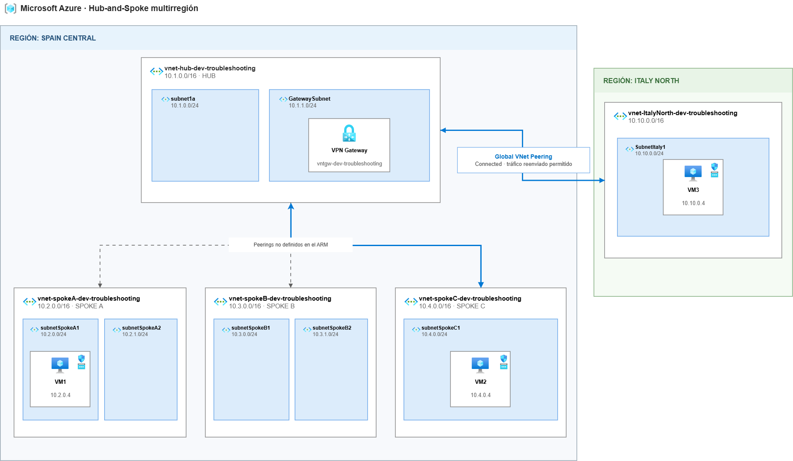

# Hub-and-spoke: missing peerings

Terraform conversion of the supplied Azure ARM template for a networking troubleshooting lab.

## Scenario

The environment contains:

- One hub VNet in Spain Central.
- Three spoke VNets in Spain Central.
- One remote VNet in Italy North.
- Global VNet peering between the Spain hub and Italy North.
- Network peering between hub and spokeC.
- One Windows VM in spoke A, one Windows VM in spoke C, one Windows VM in Italy North VM.
- One NSG (Allow 3389 inbound) and one public IP for each VM.
- One VPN Gateway in the hub.

The peerings between: the hub and the two local spokes, and between the spokes are intentionally missing. This is the initial fault of the lab.

## Troubleshooting scenarios
1. VM1 cannot communicate with VM2 using their private IP addresses.
2. The local spoke VNets cannot communicate with the hub VNet.
3. Restoring the hub-to-spoke peerings does not automatically provide spoke-to-spoke connectivity.

## Troubleshooting notes

### Scenario 1: VM1 cannot communicate with VM2
- VM1 (10.2.0.4) cannot reach VM2 (10.4.0.4): all 316 connectivity probes failed.
- Inbound TCP/3389 on VM2 is allowed, and the RDP port is reachable.
- Outbound traffic from VM1 is denied because VM1 is initiating a new connection.
- NSG statefulness only permits response traffic for an already established connection.
- Next Hop returned None, confirming that no route exists between both VNets.
- Tools used: IP Flow Verify, NSG Diagnostic, Next Hop and Connection Troubleshoot.
- Root cause: missing VNet peering.

### Scenario 2: Local Spoke vNet cannot communicate with local Hub vNet
- VM1 and VM2 have no valid route to the hub VNet (10.1.0.0/16).
- Next Hop returned None using the system route from both VMs.
- Effective Routes contain no route to the hub through VirtualNetworkPeering.
- Network Topology shows no peering connections between the local spokes and the hub.
- End-to-end connectivity cannot be tested because the hub has no VM or other test endpoint.
- Tools used: Next Hop, Effective Routes and Network Topology.
- Root cause: missing hub-to-spoke VNet peerings.

### Scenario 3: Spoke-to-spoke connectivity through the hub
- Italy North and Spoke C have bidirectional peerings with the hub in Connected state.
- VM2 and VM3 have active VirtualNetworkPeering routes to the hub network.
- VM2 and VM3 cannot communicate using their private IP addresses.
- Connection Troubleshoot returned Unreachable, with all probes failing.
- Next Hop returned None for traffic between both spoke networks.
- Effective Routes contain no route between 10.4.0.0/16 and 10.10.0.0/16.
- allow_forwarded_traffic does not make the hub forward traffic automatically.
- Tools used: Connection Troubleshoot, Next Hop, Effective Routes and Network Topology.
- Root cause: VNet peering is not transitive. Direct peering or a routing appliance with UDRs is required.

