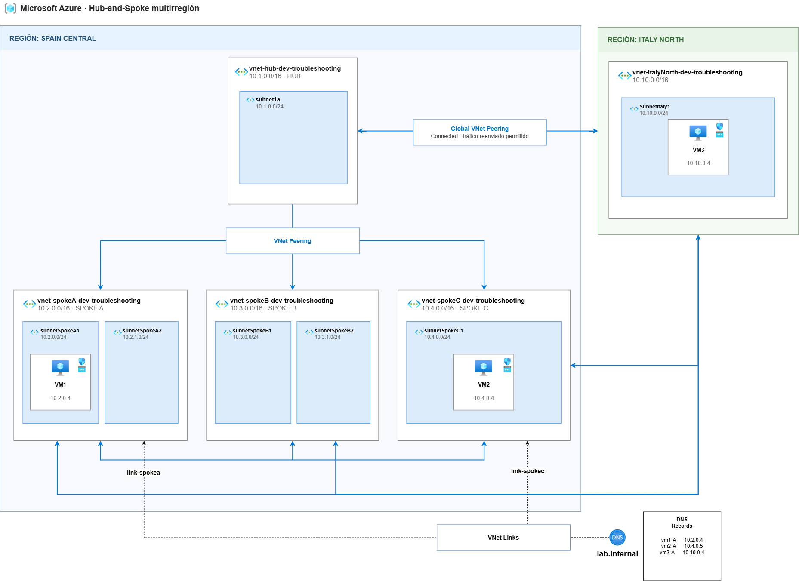

# Private DNS troubleshooting

## Scenario

## Troubleshooting scenarios

1. VM3 can reach the other virtual machines by private IP address but cannot resolve their private DNS names.
2. VM2 resolves to an incorrect private IP address.
3. A corrected DNS record continues returning an outdated address because of DNS caching.

## Troubleshooting notes

### Scenario 1: VM3 cannot resolve private DNS names
- VM3 can reach VM1 and VM2 through their private IP addresses using TCP/22.
- Connection Troubleshoot confirms that private IP connectivity is available.
- IP Flow Verify and NSG Diagnostic confirm that outbound and inbound traffic is allowed.
- Next Hop returns VirtualNetworkPeering, confirming that valid routes exist between the VNets.
- Queries for vm1.lab.internal and vm2.lab.internal from VM3 fail, while the same names resolve correctly from linked VNets.
- The Azure DNS server is reachable, but it cannot resolve the private zone from Italy North.
- Tools used: Connection Troubleshoot, IP Flow Verify, NSG Diagnostic, Next Hop, dig, nslookup and resolvectl.
- Root cause: the Italy North VNet is not linked to the lab.internal Private DNS Zone.

### Scenario 2: VM2 resolves to an incorrect private IP address
- vm2.lab.internal resolves to 10.4.0.5, while the actual private IP address of VM2 is 10.4.0.4.
- VM1 can reach VM2 using 10.4.0.4, confirming that network connectivity is available.
- Connection Troubleshoot reports the real address as reachable but the address returned by DNS as unreachable.
- IP Flow Verify and NSG Diagnostic confirm that TCP/22 traffic between VM1 and VM2 is allowed.
- Next Hop returns VirtualNetworkPeering for both addresses because they belong to the Spoke C address space.
- Network Watcher Topology confirms that 10.4.0.4 is assigned to the VM2 network interface.
- Tools used: Connection Troubleshoot, IP Flow Verify, NSG Diagnostic, Next Hop, Network Watcher Topology, dig and getent.
- Root cause: the vm2.lab.internal A record contains the incorrect private IP address 10.4.0.5.

### Scenario 3: A corrected DNS record continues returning an outdated address
- The vm2.lab.internal record was corrected from 10.4.0.5 to the actual VM2 address, 10.4.0.4.
- Azure Private DNS shows the correct address, but VM1 temporarily continues resolving the name to 10.4.0.5.
- The decreasing TTL confirms that VM1 is using a cached DNS response.
- Connection Troubleshoot reports 10.4.0.4 as reachable and the outdated 10.4.0.5 address as unreachable.
- Another VM without the cached response resolves vm2.lab.internal to the correct address.
- Flushing the local DNS cache causes VM1 to retrieve the updated record and restores connectivity by name.
- Tools used: Connection Troubleshoot, Network Watcher Topology, dig, resolvectl and nc.
- Root cause: the previous DNS response remained cached according to its original TTL.
